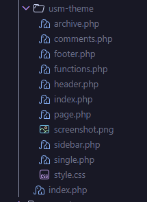
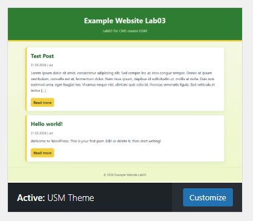
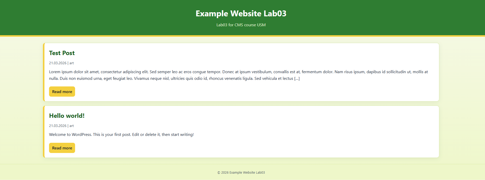
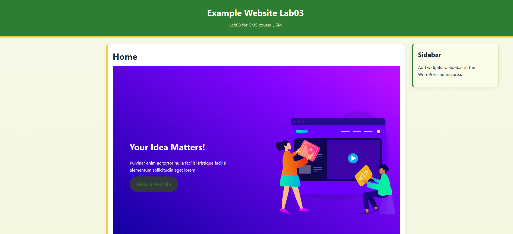

# Лабораторная работа №3: Создание и шаблонизация темы WordPress

## Описание лабораторной работы
Цель работы: создать собственную тему WordPress `usm-theme`, подключить базовые шаблоны, вынести общие части в отдельные файлы, добавить стилизацию и проверить работу темы на локально поднятом Wordpress.

В рамках работы выполнено:
- создана директория темы `wordpress/wordpress/wp-content/themes/usm-theme`;
- подготовлены обязательные файлы темы (`style.css`, `index.php`);
- вынесены общие шаблонные части (`header.php`, `footer.php`, `sidebar.php`);
- реализованы дополнительные шаблоны (`single.php`, `page.php`, `archive.php`, `comments.php`);
- добавлен `functions.php` для подключения стилей;
- оформлены базовые стили для шапки, подвала, контента и боковой панели;
- добавлен `screenshot.png` (1200x900) для превью темы.

## Инструкции по запуску проекта
1. Перейти в корень проекта:
```powershell
cd d:\Arthurs\USM\cms-usm
```

2. Убедиться, что создан файл `.env` (если нет, скопировать из примера):
```powershell
Copy-Item .env.example .env
```

3. Поднять контейнеры:
```powershell
docker compose up -d
```

4. Открыть сайт:
```text
http://localhost:8080
```
Порт берется из переменной `WP_HTTP_PORT` в `.env`.

5. Активировать тему:
- WordPress Admin -> `Appearance` -> `Themes` -> `USM Theme` -> `Activate`.

6. Остановить окружение:
```powershell
docker compose down
```

## Краткая документация к теме
Основные файлы темы:
- `style.css` - метаданные темы и стили.
- `functions.php` - подключение CSS через `wp_enqueue_style()`.
- `index.php` - главный шаблон, вывод последних 5 постов.
- `header.php` - шапка страницы.
- `footer.php` - подвал страницы.
- `sidebar.php` - боковая панель.
- `single.php` - отображение отдельной записи.
- `page.php` - отображение статической страницы.
- `archive.php` - шаблон архивов.
- `comments.php` - блок и форма комментариев.
- `screenshot.png` - превью темы (1200x900).

Особенности реализации:
- на главной странице используется `WP_Query` с `posts_per_page => 5`;
- `header`, `footer`, `sidebar` подключаются через `get_header()`, `get_footer()`, `get_sidebar()`;
- комментарии подключаются через `comments_template()` в `single.php` и `page.php`;
- для темы применена базовая зелено-желтая палитра;
- для широких экранов сайдбар расположен справа.

## Примеры использования темы
1. Главная страница:
- выводит последние 5 опубликованных записей с датой, автором и ссылкой `Read more`.

2. Страница записи (`single.php`):
- отображает полный контент поста и блок комментариев.

3. Статическая страница (`page.php`):
- отображает контент страницы и комментарии (если включены).

4. Архив (`archive.php`):
- отображает заголовок архива, список записей и навигацию по страницам.

## Скриншоты
### Структура файлов


### Активированная тема


### Главная страница с последними записями


### Домашняя страница "Home"


## Дополнение: проверка среды и отладки
### 1) Папка с темами WordPress
```text
Directory: D:\Arthurs\USM\cms-usm\wordpress\wordpress\wp-content\themes

Mode                 LastWriteTime         Length Name
----                 -------------         ------ ----
da----        2026-03-21     14:46                astra
da----        2025-07-14     12:24                twentytwentyfive
da----        2025-04-14     18:25                twentytwentyfour
da----        2025-04-14     18:25                twentytwentythree
d-----        2026-03-21     18:26                usm-theme
```

### 2) Включение и проверка `WP_DEBUG` через Docker env
`wp-config.php`:
```php
define( 'WP_DEBUG', !!getenv_docker('WORDPRESS_DEBUG', '') );
```

`docker-compose.yml`:
```yaml
environment:
  WORDPRESS_DEBUG: ${WP_DEBUG}
```

Проверка внутри контейнера:
```bash
# printenv | grep -i "debug"
WP_DEBUG=true
```

## Ответы на контрольные вопросы
1. Какие два файла являются обязательными для любой темы WordPress?  
`style.css` и `index.php`.

2. Как подключаются общие части шаблонов (`header`, `footer`, `sidebar`)?  
Через стандартные функции шаблонов WordPress: `get_header()`, `get_footer()`, `get_sidebar()`.

3. Чем отличаются `index.php`, `single.php` и `page.php`?  
- `index.php` - базовый (fallback) шаблон темы, часто используется для главной/ленты.  
- `single.php` - шаблон отдельной записи (post).  
- `page.php` - шаблон статической страницы (page).

4. Зачем нужен файл `functions.php` в теме?  
Для регистрации и подключения функциональности темы: стили/скрипты, меню, сайдбары, поддержка возможностей темы, хуки и фильтры.

## Список использованных источников
- Официальная документация WordPress Theme Handbook: https://developer.wordpress.org/themes/
- Template Files (WordPress): https://developer.wordpress.org/themes/basics/template-files/
- Including CSS & JavaScript (`wp_enqueue_style`): https://developer.wordpress.org/themes/basics/including-css-javascript/
- Template Tags (`get_header`, `get_footer`, `get_sidebar`, `comments_template`): https://developer.wordpress.org/themes/basics/template-tags/

## Дополнительные важные аспекты
- Отладка WordPress в данном Docker-окружении управляется через `WORDPRESS_DEBUG` (переменные окружения), а не жестко прописанным `define('WP_DEBUG', true);`.
- Для полного сброса БД используется:
```powershell
docker compose down -v
```
