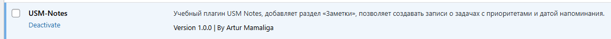
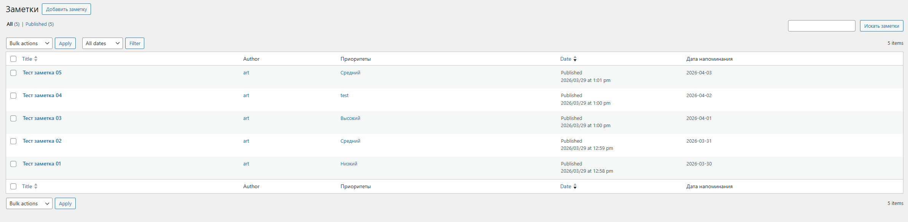
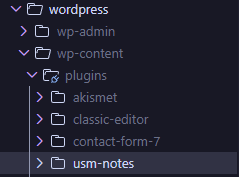
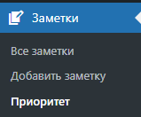
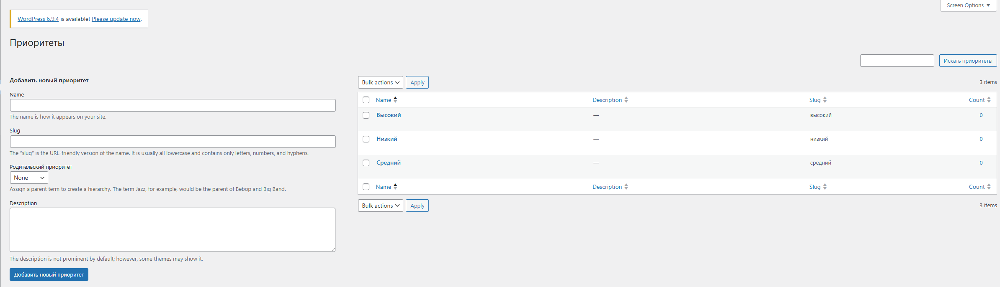

# Лабораторная работа №4: Разработка плагина для WordPress

## Описание лабораторной работы

### Цель работы
Создать плагин, использующий CPT (Custom Post Type), пользовательскую таксономию, метаданные с метабоксом в админ-панели, а также реализовать вывод данных на сайте через шорткод.

### Условие
Создать учебный плагин `USM-Notes`, который добавляет в сайт раздел "Заметки" с приоритетами и датой напоминания.

### Ход выполнения

#### Шаг 1. Подготовка среды
- В локальной установке WordPress использована папка `wp-content/plugins`.
- Создана директория плагина `usm-notes`.
- Включен debug-режим через `WP_DEBUG` и `WP_DEBUG_LOG`.
- Исправлена ошибка активации `3 characters of unexpected output` (причина: BOM в начале PHP-файла).

#### Шаг 2. Создание основного файла плагина
- Создан файл `usm-notes.php`.
- Добавлены метаданные плагина:
```php
<?php
/**
 * Plugin Name: USM-Notes
 * Description: Учебный плагин USM Notes, добавляет раздел "Заметки", позволяет создавать записи о задачах с приоритетами и датой напоминания.
 * Version: 1.0.0
 * Author: Artur Mamaliga
 */
```
- Плагин активирован в админ-панели.

- Проверка выполнена через статус плагина.

#### Шаг 3. Регистрация Custom Post Type (CPT)
- Добавлена функция регистрации CPT `notes` через `register_post_type()`.
```php
function usm_notes_register_cpt() {
	$labels = array(
    //...
	);

	$args = array(
    //...
		),
	);

	register_post_type( 'notes', $args );
}
```
- Настроены параметры: `public`, `supports`, `has_archive`, `menu_icon`, `labels`.
- Регистрация подключена к хуку `init`. (`add_action( 'init', 'usm_notes_register_cpt' );`)

#### Шаг 4. Регистрация пользовательской таксономии
- Добавлена таксономия `priority` через `register_taxonomy( 'priority', array( 'notes' ), $args );`.
- Таксономия связана с CPT `notes`.
- Настроены параметры: `hierarchical`, `public`, `labels`.
- Регистрация подключена к хуку `init`.
- Добавлено создание стартовых терминов: `Низкий`, `Средний`, `Высокий`.

#### Шаг 5. Добавление метабокса для даты напоминания
- Добавлен метабокс "Дата напоминания" через `add_meta_box()`.
- Использовано поле HTML5 `input type="date"`.
- Реализовано сохранение через `save_post`.
- Добавлены проверки: `nonce`, права пользователя, защита от autosave/revision. (`wp_nonce_field( 'usm_notes_save_reminder_date', 'usm_notes_reminder_date_nonce' );`)
- Поле даты сделано обязательным и проверяется на сервере.
```php
	if ( '' === $raw_date ) {
		usm_notes_set_admin_error( 'Поле "Дата напоминания" обязательно для заполнения.' );
		delete_post_meta( $post_id, '_usm_notes_reminder_date' );
		return;
	}
```
- Добавлена валидация: дата не может быть в прошлом.
- При ошибке выводится `admin notice`.
- Дата напоминания выведена колонкой в списке записей CPT.

#### Шаг 6. Создание шорткода для отображения заметок
- Реализован шорткод:
  - `[usm_notes]`
  - `[usm_notes priority="X"]`
  - `[usm_notes before_date="YYYY-MM-DD"]`
- Логика фильтрации:
  - `priority` фильтрует по slug таксономии
  - `before_date` фильтрует по дате напоминания с условием `<=`
  - если фильтры не указаны, выводятся все заметки
- В карточке выводятся: заголовок, дата, приоритет, excerpt.
- Добавлены стили через `<style>`.
- Если нет подходящих данных, выводится: `Нет заметок с заданными параметрами`.

#### Шаг 7. Тестирование плагина
- Добавлено 5 заметок с разными датами и приоритетами.
- Создана страница `All Notes`.
- Проверены сценарии:
  - `[usm_notes]`
  - `[usm_notes priority="high"]`
  - `[usm_notes before_date="2025-04-30"]`
  
- Отдельно проверен кейс со slug приоритета: филь тр работает только по корректному slug термина.

## Инструкции по запуску проекта
1. Скопировать переменные окружения:
```powershell
Copy-Item .env.example .env
```
2. Проверить `.env` (`WP_HTTP_PORT`, `DB_NAME`, `DB_USER`, `DB_PASSWORD`, `DB_ROOT_PASSWORD`, `WORDPRESS_TABLE_PREFIX`).
3. Поднять контейнеры:
```powershell
docker compose up -d --build
```
4. Открыть сайт: `http://localhost:<WP_HTTP_PORT>`.
5. В админке активировать плагин `USM-Notes`.

## Краткая документация к теме
Плагин `USM-Notes` добавляет:
- CPT `notes` (раздел "Заметки")
- таксономию `priority`
- метаполе `_usm_notes_reminder_date`
- шорткод `[usm_notes]` с фильтрами


### 1) Регистрация CPT и таксономии
```php
function usm_notes_register_cpt() {
	$args = array(
		'public'       => true,
		'has_archive'  => true,
		'show_in_rest' => true,
		'supports'     => array( 'title', 'editor', 'author', 'thumbnail' ),
	);

	register_post_type( 'notes', $args );
}

function usm_notes_register_priority_taxonomy() {
	$args = array(
		'hierarchical' => true,
		'public'       => true,
		'show_in_rest' => true,
	);

	register_taxonomy( 'priority', array( 'notes' ), $args );
}

add_action( 'init', 'usm_notes_register_cpt' );
add_action( 'init', 'usm_notes_register_priority_taxonomy' );
```
Объяснение: здесь формируется модель данных. Если не связать таксономию с `notes`, фильтр по приоритету в шорткоде не сработает.

### 2) Сохранение даты с nonce и проверками
```php
function usm_notes_save_reminder_date_meta( $post_id, $post ) {
	if ( 'notes' !== $post->post_type ) {
		return;
	}

	if (
		! isset( $_POST['usm_notes_reminder_date_nonce'] ) ||
		! wp_verify_nonce(
			sanitize_text_field( wp_unslash( $_POST['usm_notes_reminder_date_nonce'] ) ),
			'usm_notes_save_reminder_date'
		)
	) {
		return;
	}

	$raw_date = isset( $_POST['usm_notes_reminder_date'] )
		? sanitize_text_field( wp_unslash( $_POST['usm_notes_reminder_date'] ) )
		: '';

	if ( '' === $raw_date ) {
		usm_notes_set_admin_error( 'Поле "Дата напоминания" обязательно для заполнения.' );
		return;
	}

	if ( $raw_date < current_time( 'Y-m-d' ) ) {
		usm_notes_set_admin_error( 'Дата напоминания не может быть в прошлом.' );
		return;
	}

	update_post_meta( $post_id, '_usm_notes_reminder_date', $raw_date );
}
```
Объяснение: `required` в HTML можно обойти, поэтому критична серверная валидация. `nonce` защищает от CSRF.

### 3) Шорткод и фильтры
```php
function usm_notes_shortcode( $atts ) {
	$atts = shortcode_atts(
		array(
			'priority'    => '',
			'before_date' => '',
		),
		$atts,
		'usm_notes'
	);

	$args = array(
		'post_type'      => 'notes',
		'post_status'    => 'any',
		'posts_per_page' => -1,
		'meta_key'       => '_usm_notes_reminder_date',
		'orderby'        => array( 'meta_value' => 'ASC' ),
	);

	if ( '' !== $atts['priority'] ) {
		$args['tax_query'] = array(
			array(
				'taxonomy' => 'priority',
				'field'    => 'slug',
				'terms'    => sanitize_title( $atts['priority'] ),
			),
		);
	}

	if ( '' !== $atts['before_date'] ) {
		$args['meta_query'] = array(
			array(
				'key'     => '_usm_notes_reminder_date',
				'value'   => sanitize_text_field( $atts['before_date'] ),
				'compare' => '<=',
				'type'    => 'DATE',
			),
		);
	}

	$query = new WP_Query( $args );
}

add_shortcode( 'usm_notes', 'usm_notes_shortcode' );
```
Важно то что `priority` фильтруется по slug, а `before_date` сравнивается с метаполем даты через `<=`.

Ключевые хуки:
- `init`
- `add_meta_boxes`
- `save_post`
- `admin_notices`
- `manage_notes_posts_columns`
- `manage_notes_posts_custom_column`

## Примеры шорткодов

### Вывод всех заметок
```text
[usm_notes]
```

### Вывод по приоритету
```text
[usm_notes priority="high"]
```

### Вывод по дате напоминания
```text
[usm_notes before_date="2026-04-30"]
```

### Комбинированный фильтр
```text
[usm_notes priority="medium" before_date="2026-04-30"]
```

## Скриншоты
1. Создана директория плагина  


2. Плагин активирован с метаданными  


3. Раздел плагина в админ-меню  


4. Предустановленные приоритеты  


5. Создан новый приоритет  


6. Создание заметки  


7. Список всех заметок  


8. Тестовая страница с шорткодами  


## Дополнение
- Ошибка при активации (`3 characters of unexpected output`) была вызвана 'utf8 with BOM', оказывается три первых символа файла указывают на кодировку с BOM.
- Для фильтра `priority` нужно использовать slug термина, а не отображаемое имя и оно для удобство сделано на русском языке.
- `excerpt` не показывает изображение из контента автоматически, поэтому для картинок в списке нужна отдельная логика вывода.

## Ответы на контрольные вопросы

### Чем пользовательская таксономия отличается от метаполя?

Таксономия нужна для классификации и структурирования иерархичной упорядочности записей. Метаполе хранит индивидуальное значение конкретной записи.

Например:
- таксономия: `priority` (общий набор значений для многих заметок);
- метаполе: `due_date` (у каждой заметки своя дата).

Таксономия классифицирует записи, метаполя добавляют специфичные данные для записи.

### Зачем нужен nonce при сохранении метаполей?

`nonce` защищает от CSRF и подтверждает, что запрос пришел из легитимной формы админки. Без проверки nonce можно подделать запрос и изменить данные записи от имени авторизованного пользователя. Оно гарантирует что nonce-поле соответствует сгенерированному ранее уникальному коду, что данные отправляет авторизированный пользователь с допустимыми правами и предотвращает изменение метаданных проходящих через форму редактирования.

### Какие аргументы `register_post_type()` и `register_taxonomy()` особенно важны для фронтенда и UX?

- `public`: Доступность контента на сайте.
- `has_archive`: Задает точку входа в каталог.
- `supports`: Определяет, какие поля доступны редактору.
- `labels`: Делает интерфейс понятным, улучшает контент.
- `hierarchical`: Делает тип древовидным как `page`.
- `show_in_rest`: Определяет REST/gutenberg/js интеграцию.

## Список использованных источников
- https://developer.wordpress.org/plugins/post-types/registering-custom-post-types/
- https://developer.wordpress.org/plugins/taxonomies/working-with-custom-taxonomies/
- https://developer.wordpress.org/reference/functions/register_post_type/
- https://developer.wordpress.org/reference/functions/register_taxonomy/
- https://developer.wordpress.org/reference/functions/add_meta_box/
- https://developer.wordpress.org/reference/functions/add_shortcode/
- https://developer.wordpress.org/apis/security/nonces/