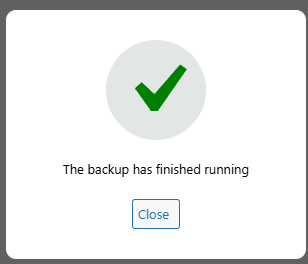
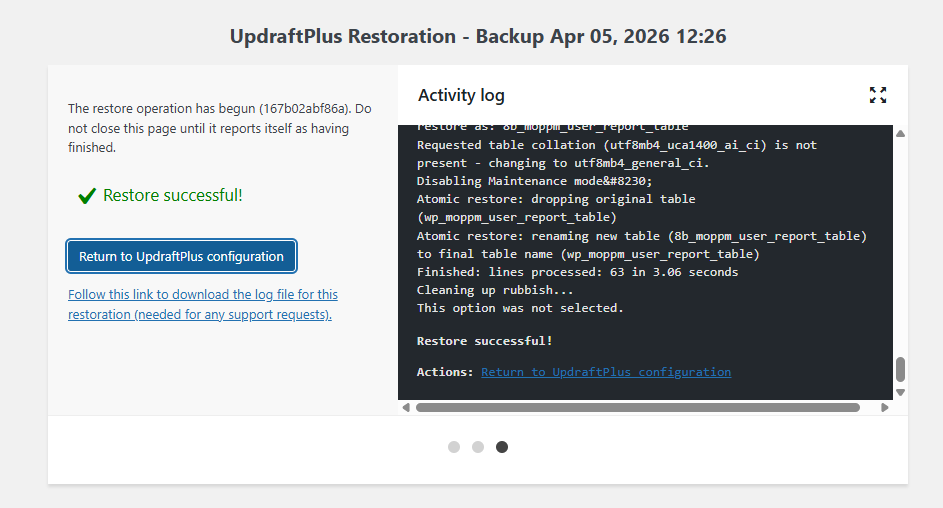

# Лабораторная работа №5: Безопасность WordPress

## Описание лабораторной работы

### Цель работы
Закрепить ключевые практики безопасности WordPress: управление ролями и паролями, обновления, базовое hardening (wp-config.php, права, отключение редактора), резервное копирование, мониторинг активности и поэтапная настройка All In One WP Security & Firewall (AIOS) для защиты от брутфорса, базового WAF и контроля прав.


## Инструкции по запуску проекта
1. Скопировать переменные окружения:
```powershell
Copy-Item .env.example .env
```
2. Проверить `.env` (`WP_HTTP_PORT`, `DB_NAME`, `DB_USER`, `DB_PASSWORD`, `DB_ROOT_PASSWORD`, `WORDPRESS_TABLE_PREFIX`).
3. Поднять контейнеры:
```powershell
docker compose up -d --build
```
4. Открыть сайт: `http://localhost:<WP_HTTP_PORT>`.
5. В админке активировать плагин `USM-Notes`.


## Ход выполнения

### 1) Подготовка среды
Включаю отладку в wp-config.
```php
if ( ! defined( 'WP_DEBUG' ) ) {
   define( 'WP_DEBUG', true );
   define('WP_DEBUG_DISPLAY', false);
   define('WP_DEBUG_LOG', true);
}
```

Источник: [Hostinger wp-debug](https://www.hostinger.com/tutorials/debug-wordpress?utm_source=google&utm_medium=cpc&utm_id=12231291749&utm_campaign=Generic-Tutorials-DSA-t1|NT:Se|LO:Other-EU&utm_term=&utm_content=685259525759&gad_source=1&gad_campaignid=12231291749&gbraid=0AAAAADMy-haF7XBkdwO8HnnGJSaC5ec1F&gclid=Cj0KCQjwkMjOBhC5ARIsADIdb3dkZhjtpkJkGKR81ZDB0IaH6eWGKHbT5SgQojfVeC2me1PCLp0hp-waAqtIEALw_wcB#h-how-to-enable-wordpress-debug-with-code)

### 2) Управление ролями и паролями
Создаю тестового пользователя с ролью "Автор".


У каждого администратора включены сложные пароли (8+ символов, буквы/цифры/символы). Сделано при помощи плагина 'Password Policy Manager', однако правила паролей распрастраняются на всех пользователей, а не только администраторов.


### 3) Обновления ядра, тем и плагинов
Проверяю наличие обновлений в Dashboard->Updates и обнаруживаю 5 доступных обновлений включая обновления вордпресс.
Мои шаги:
- Обновляю бинари вордпресса до последней версии при помощи UI.


- Отключаю докер контейнер

- Обновляю докер контейнер вордпресс:
`image: wordpress:6.8.3-php8.3-apache` -> `image: wordpress:6.9.4-php8.4-apache`


- Обновляю плагины.

- Настраиваю автоматическое обновление для тем и плагинов (Сомнительное решение).

Комментарий:
В идеале должен быть настроен пайплайн с переносом и установкой всех тем, плагинов, настроек при помощи консоли wp - после обновления вордпресс в докере, необходимые настройки и файлы для работы должны храниться отдельно от продакшена, а не только в нем, в моем же случае я просто показываю что знаю, как обновить вордпресс и флоу который я представляю в текущей неидеальной ситуации. 

- Обновленный вордпресс


- Обновленный докерфайл
```bash
> docker compose up -d
[+] up 29/29
 ✔ Image wordpress:6.9.4-php8.4-apache Pulled                                                                                                                                                                                                                                    23.3s
 ✔ Container wp_app                    Started                                                                                                                                                                                                                                   1.7s
 ✔ Container database                  Started    
```

- Обновляю тему и плагины


### 4) Базовое hardening
- Запрещаю редактирование файлов из админки:

в конце файла wp-config.php добовляю `define('DISALLOW_FILE_EDIT', true);`

- Проверяю настройки прав на файлы и папки.
Они соответствуют требуемым `755` на директории и `644` на файлы.
```bash
# ls -lh
total 220K
-rw-r--r-- 1 www-data www-data  405 Feb  6  2020 index.php
-rw-r--r-- 1 www-data www-data  20K Apr  5 09:28 license.txt
-rw-r--r-- 1 www-data www-data 7.3K Apr  5 09:28 readme.html
-rw-r--r-- 1 www-data www-data 7.2K Apr  5 09:28 wp-activate.php
drwxr-xr-x 1 www-data www-data 4.0K Sep 30  2025 wp-admin
-rw-r--r-- 1 www-data www-data  351 Feb  6  2020 wp-blog-header.php
-rw-r--r-- 1 www-data www-data 2.3K Jun 14  2023 wp-comments-post.php
-rw-r--r-- 1 www-data www-data 5.7K Dec  2 01:12 wp-config-docker.php
-rw-r--r-- 1 www-data www-data 3.3K Apr  5 09:28 wp-config-sample.php
-rw-r--r-- 1 www-data www-data 6.2K Apr  5 09:37 wp-config.php
drwxr-xr-x 1 www-data www-data 4.0K Apr  5 09:37 wp-content
-rw-r--r-- 1 www-data www-data 5.5K Aug  2  2024 wp-cron.php
drwxr-xr-x 1 www-data www-data 4.0K Apr  5 09:29 wp-includes
-rw-r--r-- 1 www-data www-data 2.5K Apr  5 09:29 wp-links-opml.php
-rw-r--r-- 1 www-data www-data 3.9K Mar 11  2024 wp-load.php
-rw-r--r-- 1 www-data www-data  51K Apr  5 09:29 wp-login.php
-rw-r--r-- 1 www-data www-data 8.6K Apr  5 09:29 wp-mail.php
-rw-r--r-- 1 www-data www-data  31K Apr  5 09:29 wp-settings.php
-rw-r--r-- 1 www-data www-data  34K Mar 10  2025 wp-signup.php
-rw-r--r-- 1 www-data www-data 5.1K Apr  5 09:29 wp-trackback.php
-rw-r--r-- 1 www-data www-data 3.2K Nov  8  2024 xmlrpc.php
```

- Ограничиваю доступ к файлу `wp-config.php`
.htaccess:
```
# BEGIN WordPress
# The directives (lines) between "BEGIN WordPress" and "END WordPress" are
# dynamically generated, and should only be modified via WordPress filters.
# Any changes to the directives between these markers will be overwritten.
<IfModule mod_rewrite.c>
RewriteEngine On
RewriteRule .* - [E=HTTP_AUTHORIZATION:%{HTTP:Authorization}]
RewriteBase /
RewriteRule ^index\.php$ - [L]
RewriteCond %{REQUEST_FILENAME} !-f
RewriteCond %{REQUEST_FILENAME} !-d
RewriteRule . /index.php [L]
</IfModule>

# END WordPress

<Files "wp-config.php">
    Require all denied
</Files>
```

### 5) Установка и первичная настройка All In One WP Security & Firewall (AIOS)

- Установил и активировал плагин.

Настройки user login:

- user lockout:


- Force logout(60min * 24 = 1440min):


Юзер 'admin' отсутствует

- Отключаю автоподтверждение при регистрации:


- Проверка File Permissions:


- Firewall

```
Enable basic firewall protection
```

- Включил защиту от Bad Query Strings, XSS, directory browsing

- Переименовал логин страницу URL

`http://localhost:8080/login-lab05`

- Настроил file change detection c уведомлением на почту `artmamaliga8@gmail.com`

- Сделал Backup



Скачал бэкап себе на хост, так как бэкапы надо хранить отдельно от сервера, в лабораторных условиях будут на хостовой машине.

- Включил email нотификации.

### 6) Проверка защиты от брутфорса.

Протестировал защиту от брутфорса юзером `art_author`, попробовав войти раз 5.
Получил следующее сообщение: `ERROR: Access from your IP address has been blocked for security reasons. Please contact the administrator.`

### 7)

Восстановление резервной копии.

Удалил страницу "Все заметки", удалил картинку "wallhaven-lqrljq-1.jpg".

Восстанавливаю бэкап через плагин.



Восстановление из бэкапа прошло успешно, сбросился пароль до состояния на момент бэкапа.
Была восстановлена страница "Все заметки", а также изображение.

## Контрольные вопросы.
## Контрольные вопросы

### 1) Почему DISALLOW_FILE_EDIT и права на wp-config.php уменьшают риск пост-эксплойта?

- `DISALLOW_FILE_EDIT` отключает встроенный редактор файлов в WordPress → злоумышленник не сможет внедрить вредоносный код через админку.
- Ограниченные права на `wp-config.php` (например, `600`) защищают:
  - от чтения (утечка DB credentials и ключей)
  - от изменения (внедрение backdoor)
- В результате атакующий не может легко закрепиться после получения доступа → требуется доступ к файловой системе.

---

### 2) Параметры Login Lockdown / Firewall и обоснование

Выбранные параметры:
- Max retries: 3–5
- Lockout time: 15–30 минут
- Retry window: ~15 минут
- Включён WAF и защита от brute-force

Обоснование:
- Ограничение попыток блокирует автоматический перебор паролей
- Время блокировки замедляет атаки
- При этом:
  - пользователь не блокируется слишком надолго
  - снижается риск ложных блокировок

→ достигается баланс между безопасностью и удобством (UX)

---

### 3) Различия уровней защиты

| Уровень        | Особенности |
|----------------|------------|
| WordPress      | Плагины, WAF, защита логина; работает на уровне PHP |
| Веб-сервер     | `.htaccess`, правила доступа, блокировки; работает до PHP |
| ОС / Docker    | Права файлов, изоляция, firewall; базовый уровень |

Вывод:  
Чем ниже уровень (OS → Web → WP), тем защита надёжнее и сложнее обходится.

---

### 4) Что входит в полный backup и как проверяется восстановление

Полный backup включает:
- База данных (контент, пользователи, настройки)
- `wp-content/` (темы, плагины, uploads)
- `wp-config.php`
- (опционально) `.htaccess`

Проверка восстановления:
1. Разворачивается чистое окружение (например, новый Docker-контейнер)
2. Восстанавливаются файлы и БД
3. Проверяется:
   - доступность сайта
   - вход в админку
   - корректная работа медиа и плагинов

Критерий:  
Backup считается валидным, если сайт полностью работоспособен после восстановления.